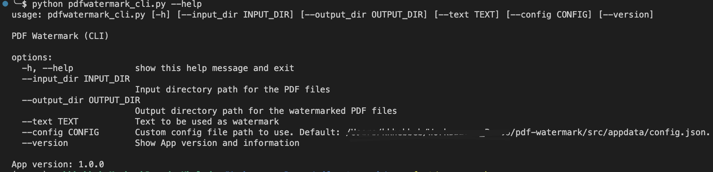
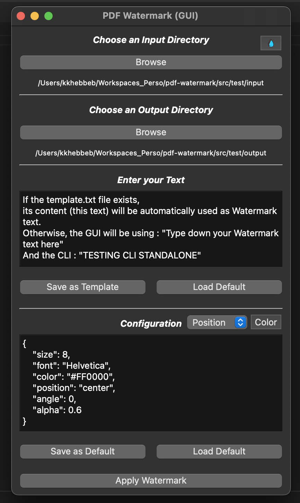

<div align="center">
<h1 align="center">

<br>
pdf-watermark
</h1>
<h3 align="center">📍 Level up your PDFs with pdf-watermark: Leave your mark on every page!</h3>
<h3 align="center">⚙️ Developed with the software and tools below:</h3>

<p align="center">


</p>
</div>

---

## 📚 Table of Contents
- [📚 Table of Contents](#-table-of-contents)
- [📍 Overview](#-overview)
- [💫 Features](#-features)
- [📂 Project Structure](#project-structure)
- [🧩 Modules](#modules)
- [🚀 Getting Started](#-getting-started)
- [🗺 Roadmap](#-roadmap)
- [🤝 Contributing](#-contributing)
- [📄 License](#-license)
- [👏 Acknowledgments](#-acknowledgments)

---


## 📍 Overview

This project is a PDF watermarking tool that provides both a command-line interface (CLI) and a graphical user interface (GUI). Its core functionalities include applying watermarks to PDF files, with the ability to customize settings such as text size, position, color, and font. The tool offers convenience and efficiency by allowing users to process multiple PDF files at once. Its value proposition lies in its simplicity and ease of use, making it a useful tool for individuals or organizations that need to protect their PDF documents with watermarks.

---

## 💫 Features

Feature | Description |
|---|---|
| **🏗 Structure and Organization** | The codebase has a clear organization with separate files for the CLI and GUI versions, as well as a file for constants and variables. There is also a version file and a separate directory for storing input and output files. |
| **📝 Code Documentation** | The codebase lacks comprehensive documentation, making it difficult for new developers to understand the functionality and usage of the application. |
| **🧩 Dependency Management** | The codebase manages dependencies using external libraries such as PyPDF2, reportlab, and PyQt6, which are imported in the necessary files for PDF manipulation, watermark generation, and GUI development, respectively. |
| **♻️ Modularity and Reusability** | The codebase demonstrates modularity and reusability by separating the CLI and GUI versions into individual files, allowing these components to be used independently or together. |
| **🔒 Security Measures** | There is no specific information available about security measures, so it's unclear if there are any specific measures implemented to protect user data or prevent vulnerabilities. |
| **🔌 External Integrations** | The codebase integrates external libraries such as PyPDF2, reportlab, and PyQt6 for PDF manipulation, watermark generation, and GUI development, respectively. |
| **📈 Scalability and Extensibility** | The codebase can be extended and scaled by adding new functionality or modifying existing code due to its modular design and separation of different components. |

---


## 📂 Project Structure


```bash
repo
├── LICENSE
├── VERSION
└── src
    ├── config.json
    ├── misc.py
    ├── requirements.txt
    ├── template.txt
    ├── test
    │   ├── input
    │   │   └── pdf-test.pdf
    │   └── output
    │       ├── NAME_MARKED_POSITION_SIZE.pdf
    │       ├── pdf-test_marked_bottom-left_8.pdf
    │       ├── pdf-test_marked_bottom-right_8.pdf
    │       ├── pdf-test_marked_bottom_8.pdf
    │       ├── pdf-test_marked_center_8.pdf
    │       ├── pdf-test_marked_left_8.pdf
    │       ├── pdf-test_marked_right_8.pdf
    │       ├── pdf-test_marked_top-left_8.pdf
    │       ├── pdf-test_marked_top-right_8.pdf
    │       └── pdf-test_marked_top_8.pdf
    ├── watermark.ico
    ├── watermark_cli.py
    └── watermark_gui.py

4 directories, 21 files
```

---


## 🧩 Modules

<details closed><summary>Root</summary>

| File    | Summary                                                                                                                                                                                       | Module   |
|:--------|:----------------------------------------------------------------------------------------------------------------------------------------------------------------------------------------------|:---------|
| VERSION | The provided code snippet is not given, so it is not possible to offer a comprehensive summary of its core functionalities. Please provide the code snippet so that I can assist you further. | VERSION  |

</details>

<details closed><summary>Src</summary>

| File             | Summary                                                                                                                                                                                                                                                                                                                                                                                                                                                                                                                                    | Module               |
|:-----------------|:-------------------------------------------------------------------------------------------------------------------------------------------------------------------------------------------------------------------------------------------------------------------------------------------------------------------------------------------------------------------------------------------------------------------------------------------------------------------------------------------------------------------------------------------|:---------------------|
| watermark_cli.py | This code snippet provides a watermarking functionality for PDF files. It loads a configuration file with settings for the watermark, such as text size, position, color, and font. It then applies the watermark to all PDF files in a specified input directory, saving the watermarked files in an output directory. The code uses the PyPDF2 and reportlab libraries for PDF manipulation and watermark generation, respectively. It also includes a command-line interface (CLI) for easy execution and customization.                | src/watermark_cli.py |
| misc.py          | This code snippet defines several constants and variables for a PDF watermarking application. It includes paths to input and output directories, configuration files, and a template file. It also sets up default values for the watermark properties. The snippet handles reading the template file and the version file, and contains information about the application's name, version, and usage instructions for both the GUI and CLI versions.                                                                                      | src/misc.py          |
| watermark_gui.py | The provided code snippet is a GUI application for adding watermarks to PDF files. It uses the PyQt6 library for creating the graphical user interface. The application allows users to select an input directory and an output directory, enter a watermark text, and adjust configuration settings. It also provides options to load and save templates, set colors, and choose watermark positions. The application applies the watermark to the PDF files in the input directory and saves the modified files in the output directory. | src/watermark_gui.py |

</details>

---

## 🚀 Getting Started

### ✅ Prerequisites

Before you begin, ensure that you have the following prerequisites installed:
> - Tested on MacOS Monterey V12.5
> - Requires Python 3.11.4 and +

### 🖥 Installation

1. Clone the pdf-watermark repository:
```sh
git clone https://github.com/aanorlondo/pdf-watermark.git
```

2. Change to the project directory:
```sh
cd pdf-watermark
```

3. Install the dependencies:
```sh
pip install -r requirements.txt
```

## 🤖 Using pdf-watermark


### Configuration management 
The tools configuration (color, font, position, etc.) is held within the `src/config.json` file
    - You can edit and redefine the default configuration as you please.

### Template management:
You can save your custom text as template for your your watermarks
    - You can save your template wihin the `src/template.txt` file

### Using the CLI Interface
```
python watermark_cli.py --help
```





### Using the GUI Interface
```
python watermark_gui.py
```



---


## 🗺 Roadmap

> - [] Improve the rotation algorithm


---

## 🤝 Contributing

Contributions are always welcome! Please follow these steps:
1. Fork the project repository. This creates a copy of the project on your account that you can modify without affecting the original project.
2. Clone the forked repository to your local machine using a Git client like Git or GitHub Desktop.
3. Create a new branch with a descriptive name (e.g., `new-feature-branch` or `bugfix-issue-123`).
```sh
git checkout -b new-feature-branch
```
4. Make changes to the project's codebase.
5. Commit your changes to your local branch with a clear commit message that explains the changes you've made.
```sh
git commit -m 'Implemented new feature.'
```
6. Push your changes to your forked repository on GitHub using the following command
```sh
git push origin new-feature-branch
```
7. Create a pull request to the original repository.
Open a new pull request to the original project repository. In the pull request, describe the changes you've made and why they're necessary.
The project maintainers will review your changes and provide feedback or merge them into the main branch.

---

## 📄 License

This project is licensed under the `MIT` License. See the [LICENSE](LICENCE) file for additional info.

---

## 👏 Acknowledgments
Personal project

---

## Credits

This awesome documentation was automatically generated using the [README-AI Project](https://github.com/eli64s/README-AI)

---