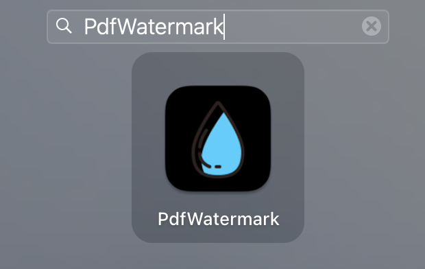

<div align="center">
<h1 align="center">

<br>
pdf-watermark
</h1>
<h3 align="center">📍 Level up your PDFs with pdf-watermark: Leave your mark on every page!</h3>
<h3 align="center">⚙️ Developed with the software and tools below:</h3>

<p align="center">


</p>
</div>

---

## 📚 Table of Contents
- [📚 Table of Contents](#-table-of-contents)
- [📍 Overview](#-overview)
- [💫 Features](#-features)
- [📂 Project Structure](#project-structure)
- [🧩 Modules](#modules)
- [🚀 Getting Started](#-getting-started)
- [🗺 Roadmap](#-roadmap)
- [🤝 Contributing](#-contributing)
- [📄 License](#-license)
- [👏 Acknowledgments](#-acknowledgments)

---


## 📍 Overview

The "PdfWatermark" project is a Python-based toolkit that offers multiple solutions for adding watermarks to PDF files. It provides a command line interface (CLI) application, a graphical user interface (GUI) application, and a core module that can be integrated into other applications. The project's key functionalities include the ability to apply configurable watermarks to multiple PDF files, define watermark text, position, and color, and save/load watermark configurations and templates. Its purpose is to provide a flexible and user-friendly solution for adding watermarks to PDF files, offering convenience and customization options to users.

---

## 💫 Features

Feature | Description |
|---|---|
| **🏗 Structure and Organization** | The codebase follows a modular structure with separate files for different functionality such as CLI, GUI, watermarking logic, setup, and miscellaneous tasks. The `src` directory contains all the source code files, and the organization of files indicates clear separation of concerns. |
| **📝 Code Documentation** | The codebase includes inline comments and docstrings that provide explanations and usage instructions, making it easier for developers to understand and maintain the code. |
| **🧩 Dependency Management** | The codebase manages dependencies using external libraries such as PyPDF2, reportlab, and PyQt6, which are imported in the necessary files for PDF manipulation, watermark generation, and GUI development, respectively. The codebase uses the `requirements.txt` file to specify the required dependencies, and the `setup.py` file manages the installation of these dependencies using `pip`. This ensures consistent dependency management and ease of installation. |
| **♻️ Modularity and Reusability** | The codebase demonstrates modularity and reusability by separating different components into independent files, allowing for easy reuse of functions and classes across different parts of the application. |
| **🔒 Security Measures** | There is no specific information available about security measures, so it's unclear if there are any specific measures implemented to protect user data or prevent vulnerabilities. |
| **🔌 External Integrations** | The codebase integrates external libraries such as PyPDF2, reportlab, and PyQt6 for PDF manipulation, watermark generation, and GUI development, respectively. |
| **📈 Scalability and Extensibility** | The codebase can be extended and scaled by adding new functionality or modifying existing code due to its modular design and separation of different components. |

---


## 📂 Project Structure


```bash
repo
├── LICENSE
├── README.md
├── docs
│   ├── cli.png
│   ├── gui.png
│   └── install.png
├── src
│   ├── appdata
│   │   ├── VERSION.txt
│   │   ├── config.json
│   │   ├── pdfwatermark.ico
│   │   └── template.txt
│   ├── misc.py
│   ├── pdfwatermark_cli.py
│   ├── pdfwatermark_core.py
│   ├── pdfwatermark_gui.py
│   ├── requirements.txt
│   ├── setup.py
│   └── setup.sh
└── test
    ├── input
    │   └── pdf-test.pdf
    └── output
        ├── NAME_MARKED_POSITION_SIZE.pdf
        ├── pdf-test_marked_bottom-left_8.pdf
        ├── pdf-test_marked_bottom-right_8.pdf
        ├── pdf-test_marked_bottom_8.pdf
        ├── pdf-test_marked_center_8.pdf
        ├── pdf-test_marked_left_8.pdf
        ├── pdf-test_marked_right_8.pdf
        ├── pdf-test_marked_top-left_8.pdf
        ├── pdf-test_marked_top-right_8.pdf
        └── pdf-test_marked_top_8.pdf

6 directories, 27 files
```

---


## 🧩 Modules

<details closed><summary>Src</summary>

| File                 | Summary                                                                                                                                                                                                                                                                                                                                                                                                                                                                                                                                                                                                                                            | Module                   |
|:---------------------|:---------------------------------------------------------------------------------------------------------------------------------------------------------------------------------------------------------------------------------------------------------------------------------------------------------------------------------------------------------------------------------------------------------------------------------------------------------------------------------------------------------------------------------------------------------------------------------------------------------------------------------------------------|:-------------------------|
| setup.sh             | This code snippet is a shell script that performs several tasks. It sets up a Python virtual environment, installs dependencies from a requirements.txt file, builds an application using a setup.py file, and then installs the built application onto the user's computer. The script provides a success message indicating the location of the installed application.                                                                                                                                                                                                                                                                           | src/setup.sh             |
| misc.py              | This code snippet defines various constants and variables related to a PDF watermarking application. It determines the current directory, sets default input and output directories, and specifies file paths for version information, configuration, and template files. It also sets GUI-related variables such as icon path, font style, and font size. Additionally, it initializes default values for watermark configuration and template text. Finally, it reads the version file and generates information strings for the application.                                                                                                    | src/misc.py              |
| pdfwatermark_core.py | The provided code snippet is a Python script that adds a watermark to PDF files. It uses the PyPDF2 library to read and merge PDF pages, the reportlab library to generate a PDF canvas for the watermark, and the json library to load and update configuration settings. The WatermarkConfig class handles the loading and updating of the watermark configuration, while the WatermarkApp class contains methods to calculate the position of the watermark, add the watermark to PDF files, and apply the watermark to all PDF files in a given directory. The script can be executed to apply a configurable watermark to multiple PDF files. | src/pdfwatermark_core.py |
| pdfwatermark_cli.py  | The provided code snippet is a standalone CLI (Command Line Interface) application that offers the functionality of adding a watermark to PDF files. It takes input parameters such as input directory, output directory, and watermark text from the command line. The application uses a custom configuration file and the pyfiglet library to display the application's name, version, and information. It validates the input parameters, checks for the presence of PDF files in the input directory, and applies the watermark to all PDF files found. If any errors occur, it displays an appropriate error message.                        | src/pdfwatermark_cli.py  |
| setup.py             | The provided code snippet is a setup script for packaging and distributing a Python application called "PdfWatermark". It uses setuptools to define the application's name, version, and other metadata. It also specifies the app's main file, data files, and build options such as an icon and plist properties. Finally, it uses py2app to build the macOS application.                                                                                                                                                                                                                                                                        | src/setup.py             |
| pdfwatermark_gui.py  | The provided code snippet is a GUI application that allows users to apply watermarks to PDF files. The application provides options to choose input and output directories, enter the watermark text, set the watermark position and color, and save/load watermark configurations and templates. It utilizes the PyQt6 library for creating the graphical interface and the pdfwatermark_cli module for performing the watermarking operations.                                                                                                                                                                                                   | src/pdfwatermark_gui.py  |

</details>

---

## 🚀 Getting Started

### ✅ Prerequisites

Before you begin, ensure that you have the following prerequisites installed:
> - Tested on MacOS Monterey V12.5
> - Requires Python 3.11.4 and +

### 🖥 Installation

1. Clone the pdf-watermark repository:
```sh
git clone https://github.com/aanorlondo/pdf-watermark.git
```

2. Change to the project directory:
```sh
cd pdf-watermark
```

3. Install the dependencies:
```sh
pip install -r requirements.txt
```

## 🤖 Using pdf-watermark


### Configuration management 
The tools configuration (color, font, position, etc.) is held within the `src/config.json` file
    - You can edit and redefine the default configuration as you please.

### Template management:
You can save your custom text as template for your your watermarks
    - You can save your template wihin the `src/template.txt` file

### Using the CLI Interface
- Show help :
    ```
    cd pdf-watermark/src
    python watermark_cli.py --help
    ```
    

- Show version :
    ```
    cd pdf-watermark/src
    python watermark_cli.py --version
    ```
    
- Enjoy !


### Using the GUI Interface

#### 1- Run from Codebase
- Run the following commands :
    ```
    cd pdf-watermark/src
    python watermark_gui.py
    ```
- Enjoy !

#### 2- Install as MacOS Desktop Application

- Run the following commands :
    ```
    cd pdf-watermark/src
    sh setup.sh
    ```
- The App distribution will be built under `pdf-watermark/src/dist/` folder. 
- The App will be installed to your User Applications folder (`HOME/Applications/PdfWatermark`), meaning that it will appear in your Dock

    

- Run the application

    

- Enjoy !
---


## 🗺 Roadmap

> - [] Improve the rotation algorithm


---

## 🤝 Contributing

Contributions are always welcome! Please follow these steps:
1. Fork the project repository. This creates a copy of the project on your account that you can modify without affecting the original project.
2. Clone the forked repository to your local machine using a Git client like Git or GitHub Desktop.
3. Create a new branch with a descriptive name (e.g., `new-feature-branch` or `bugfix-issue-123`).
```sh
git checkout -b new-feature-branch
```
4. Make changes to the project's codebase.
5. Commit your changes to your local branch with a clear commit message that explains the changes you've made.
```sh
git commit -m 'Implemented new feature.'
```
6. Push your changes to your forked repository on GitHub using the following command
```sh
git push origin new-feature-branch
```
7. Create a pull request to the original repository.
Open a new pull request to the original project repository. In the pull request, describe the changes you've made and why they're necessary.
The project maintainers will review your changes and provide feedback or merge them into the main branch.

---

## 📄 License

This project is licensed under the `MIT` License. See the [LICENSE](LICENSE) file for additional info.

---

## 👏 Acknowledgments
Personal project

---

## Credits

This awesome documentation was automatically generated using the [README-AI Project](https://github.com/eli64s/README-AI)

---